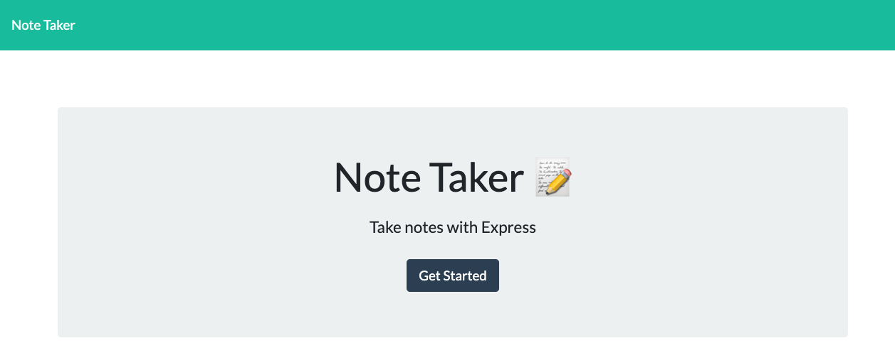
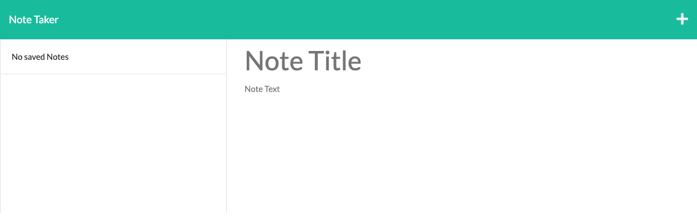

# note-app
***
## Description
This app allows the user an easy way to take notes and save them. 
***
## Table of Contents
- [Installation](#installation)
- [Usage](#usage)
- [Contributing](#contributing)
- [License](#license)
- [Test](#test)
- [Questions](#questions)
***
## Installation
No installation is required. The app runs on the browswer. 
***
## Usage
Click 'Get Started' on the homepage. Then give the note a title and fill in the body section. Click the save icon on the top right corner and your note will appear on the left side of the screen. If want a new note click the plus icon on the top right corner. 
https://limitless-temple-94341.herokuapp.com/
***
## Contributing
N/A
***
## License

## Test
N/A
***
## Questions
- https://github.com/armando1236
- For additional questions please email me at: amjr86@outlook.com

